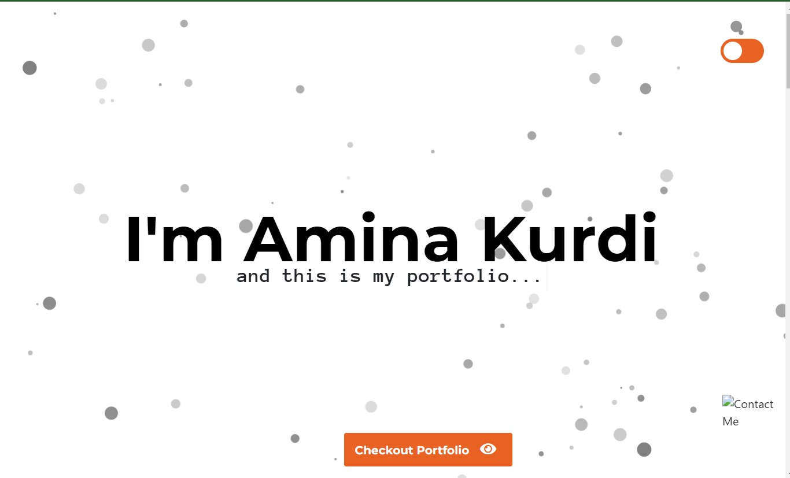
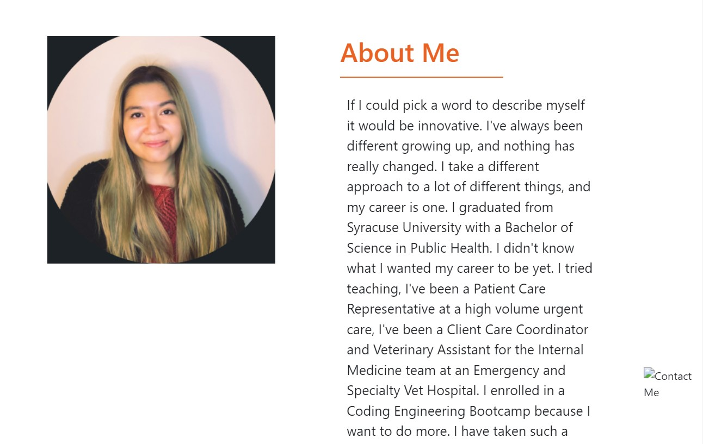
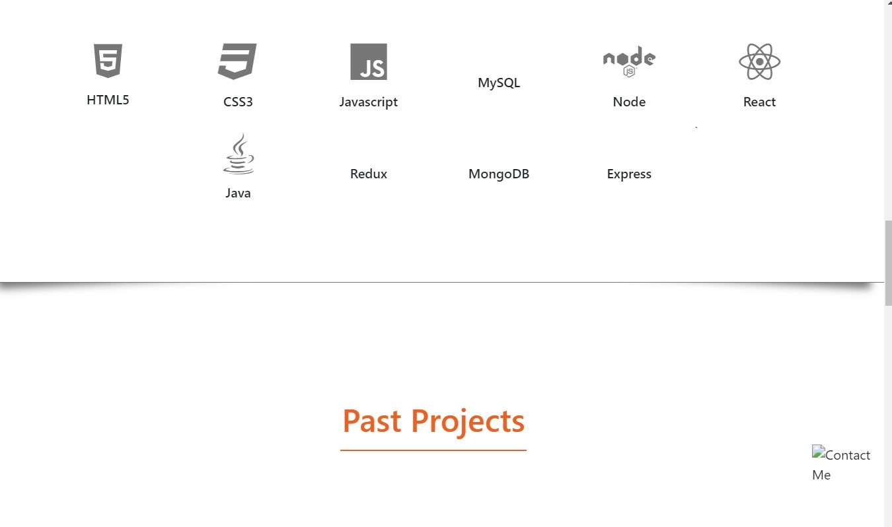
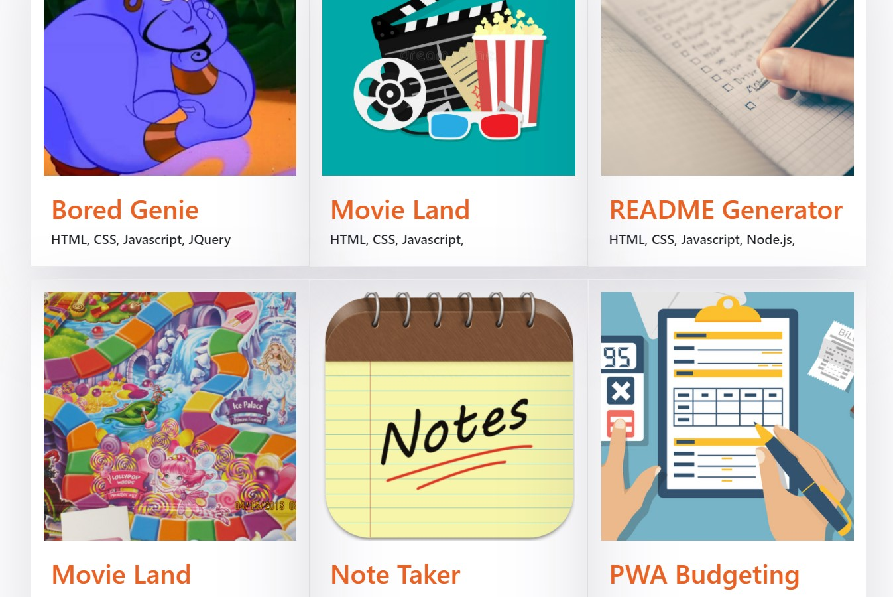
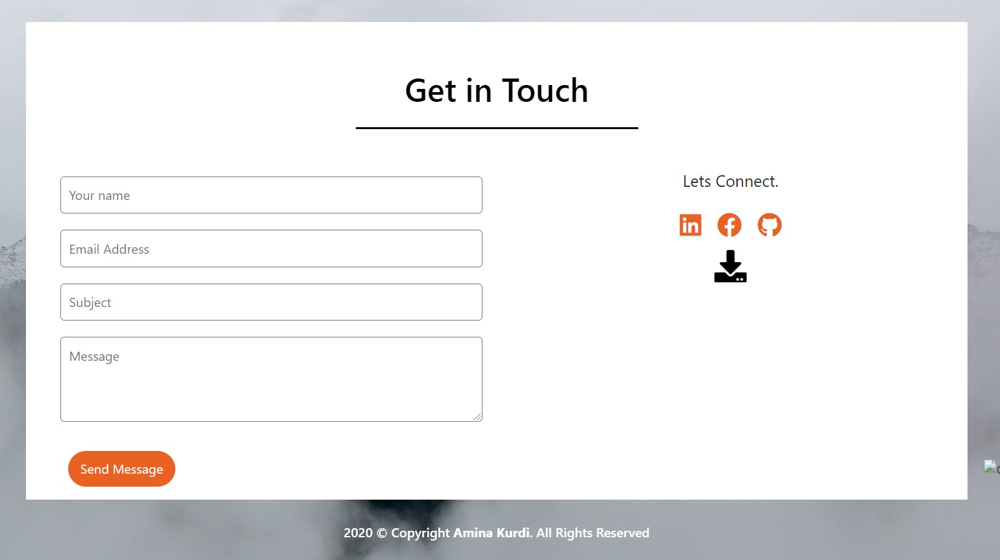

  # <h1 align="center"> 🌻 Portfolio 🌻 <h1>
  
----

## Table of Contents
- [Description](#description)
- [Installation](#installation)
- [Issues](#issue)
- [Contribution](#contribution)
- [Test Instructions](#test-instructions)
- [Questions](#questions)

----

### Description
This application uses React to create a portfolio that shows projects, contact form, and about me. 

----
### Installation
🔧React.

----
### Issues While Developing
✏️Issues I ran into was installing package dependencies. Different versions of react were only compatible with certain dependencies that i needed, so it was a lot of trial and error. I drove a lot of inspiration from kaustubhai

----
### License
✅
This application is covered by the GNU AGPLv3 license.
----

### Contributing
🤝Inspiration from kaustubhai

----
### Test-Instructions
N.A

----
### Questions
💻Find me on GitHub: [Github Profile](https://github.com/kurdiamina3)
 
📧Email me with any questions: kurdiamina3@gmail.com 
 

🌟_This README was generated with 💓 by [README-generator] (https://github.com/kurdiamina3/README-generator)🌟
